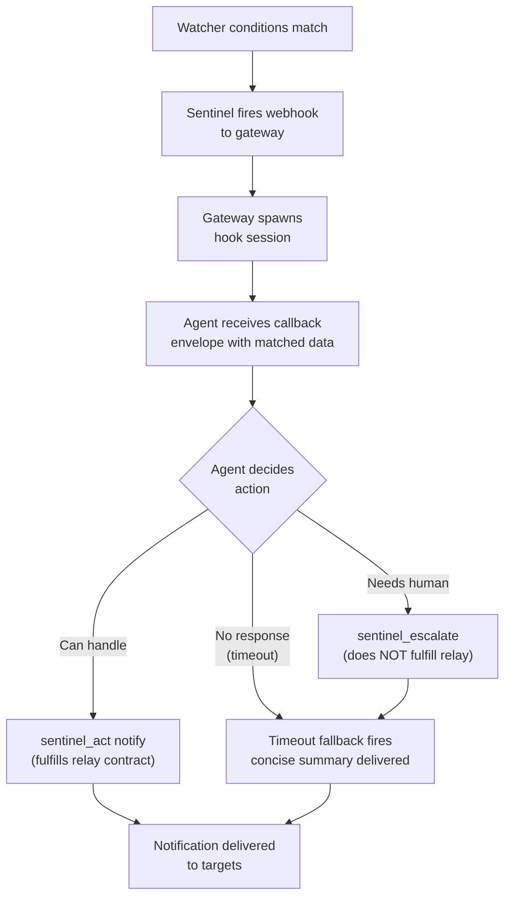

# Callbacks & Hook Sessions

When a watcher's conditions are met, sentinel spawns an isolated **hook session** — a dedicated agent session that processes the callback event.

## Callback envelope

The hook session receives a JSON payload containing:

- `watcher` — id, skillId, eventName, strategy, endpoint, tags
- `trigger` — matchedAt, dedupeKey, priority
- `mode` — environment (test/prod), operatorGoal, autonomy
- `context` / `payload` — matched data and payloadTemplate values
- `delivery` — configured delivery targets

## operatorGoal

The `fire.operatorGoal` field is the primary instruction to the callback agent — it describes what success looks like for this trigger. Write it as a natural language directive:

```
"The ETH price has dropped below $2000. Compare against the 24h average,
assess severity, and notify the #defi channel with a concise summary."
```

For dynamic instructions that change at runtime (e.g., referencing current policy files), use `fire.operatorGoalFile` — the file is read fresh at fire time and its contents are injected as `operatorGoalRuntimeContext`.

## Callback flow



## sentinel_act and sentinel_escalate

In callback sessions, use these tools (not `message`) for delivery:

### `sentinel_act`

```json
{ "action": "notify", "message": "Alert text", "targets": [...] }
{ "action": "run_command", "command": "bash", "args": ["-c", "..."] }
```

- `notify` fulfills the relay contract — cancels the timeout fallback timer
- `run_command` executes a shell command and returns stdout/stderr

### `sentinel_escalate`

```json
{ "reason": "Situation requires human decision", "severity": "warning" }
```

- Deliberately does **not** fulfill the relay contract
- The timeout fallback relay fires, delivering the raw callback summary to the user
- Use when the event is outside the agent's authority or requires human judgment

### ⚠️ Do not use the `message` tool in callback sessions

The `message` tool bypasses the relay contract. If you use `message` instead of `sentinel_act(notify)`, the timeout fallback fires anyway — resulting in **double-delivery**. Always use `sentinel_act(notify)` when you want to deliver a notification from a callback session.

## Timeout fallback

If the hook session ends without calling `sentinel_act(notify)`, sentinel's relay falls back to delivering a concise summary to the configured delivery targets after `hookResponseTimeoutMs` (default: 30s). Set `hookResponseFallbackMode: "none"` to suppress this fallback entirely.

## Model selection

The LLM model for a hook session resolves in this order:
1. `fire.model` (per-watcher override)
2. `defaultHookModel` (plugin config)
3. Gateway's agent default
